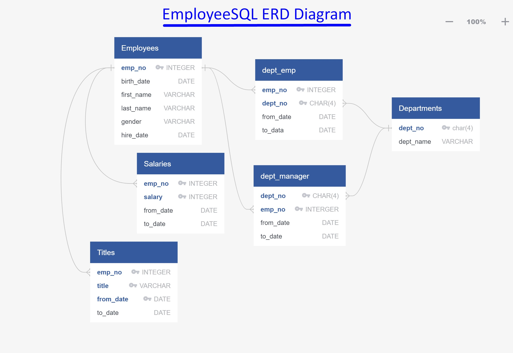

# sql-challenge: Employee Database: A Mystery in Two Parts

## Background

It is a beautiful spring day, and it is two weeks since you have been hired as a new data engineer at Pewlett Hackard. Your first major task is a research project on employees of the corporation from the 1980s and 1990s. All that remain of the database of employees from that period are six CSV files.

In this assignment, we designed tables to hold data in the CSVs, imported the CSVs into the SQL database, and answered questions about the data. The major parts were:

1. Data Modeling

2. Data Engineering

3. Data Analysis

#### Data Modeling

The provided CSVs were inspected and an ERD of the tables was created using [http://www.quickdatabasediagrams.com](http://www.quickdatabasediagrams.com).

#### Data Engineering

* Using the six CSV files in the [data](/data) directory a table schema was created: [SQL Table Schema](/EmployeeSQL/EmployeeSQL_TableSchemata.sql)

* The data in each CSV file was then imported into the corresponding SQL table.

#### Data Analysis

The following queries were then created and stored in the [SQL Queries](/EmployeeSQL/EmployeeSQL_Queries.sql):

1. List the following details of each employee: employee number, last name, first name, gender, and salary.

2. List employees who were hired in 1986.

3. List the manager of each department with the following information: department number, department name, the manager's employee number, last name, first name, and start and end employment dates.

4. List the department of each employee with the following information: employee number, last name, first name, and department name.

5. List all employees whose first name is "Hercules" and last names begin with "B."

6. List all employees in the Sales department, including their employee number, last name, first name, and department name.

7. List all employees in the Sales and Development departments, including their employee number, last name, first name, and department name.

8. In descending order, list the frequency count of employee last names, i.e., how many employees share each last name.

## Bonus (Optional)

As we examined the data, we were overcome with a creeping suspicion that the dataset is fake. We surmised that our boss handed us spurious data in order to test our data engineering skills since we were a new employee. To confirm our hunch, we decided to take the following steps to generate a visualization of the data, with which we will confront our boss:

1. The SQL database was imported into Pandas using a .gitignore and a config.py file to store the username/password to connect to the database.

2. A histogram was created to visualize the most common salary ranges for employees. It was $40,000-$50,000 for the majority of the employees.

This histogram looks suspicious because the vast majority of employees are paid between $40k and $50k.

3. A bar chart of average salary by title was created. 
This bar chart also looks as though it is using manufactured data, since it is unlikely that all the job titles would have roughly the same salary avearage.

## Epilogue

Evidence in hand, you march into your boss's office and present the visualization. With a sly grin, your boss thanks you for your work. On your way out of the office, you hear the words, "Search your ID number." You look down at your badge to see that your employee ID number is 499942.
The name turns out to be "April Foolsday" so this was an exercise by my boss afterall.
